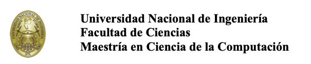
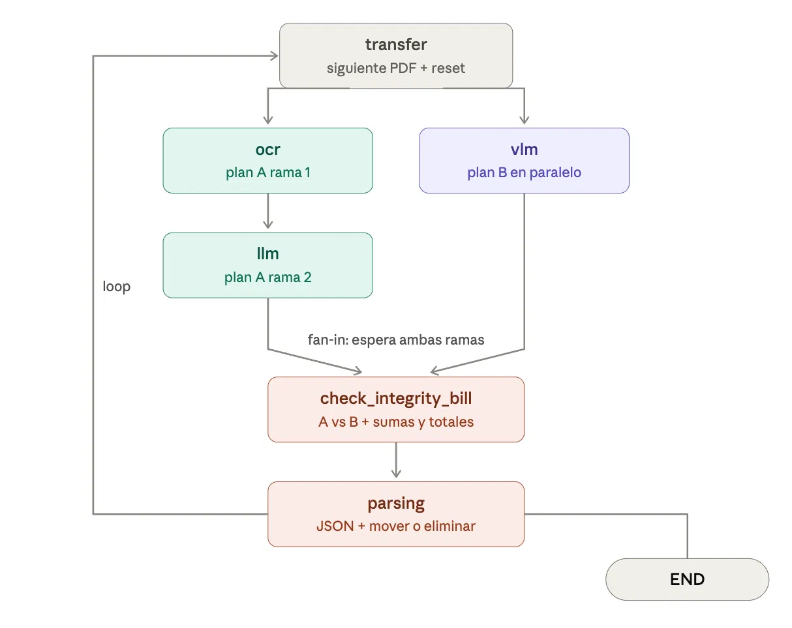

# Automatización inteligente de extracción de facturas

## Descripción del problema

Este proyecto responde a una necesidad operativa de una empresa internacional de courier con alta demanda de importaciones en el Perú. La organización recibe grandes volúmenes de facturas emitidas en distintos países, idiomas, formatos y estructuras, lo que dificulta su procesamiento mediante métodos tradicionales.

Actualmente, la información de cada factura es revisada y registrada manualmente. Debido al incremento sostenido del volumen documental, este procedimiento presenta limitaciones de tiempo, escalabilidad, costo y precisión.

El proyecto plantea las bases de una solución de inteligencia artificial multimodal capaz de automatizar la lectura, interpretación, validación y extracción de datos de facturas heterogéneas.

## Estrategia de solución

La arquitectura propuesta combina varias técnicas para equilibrar precisión, tiempo de respuesta y costo computacional:

1. **PaddleOCR** para convertir documentos PDF o imágenes en texto procesable.
2. **LLM local** para interpretar el contenido extraído, identificar patrones y estructurar los datos de la factura.
3. **Qwen2.5-VL** como modelo visual multimodal de respaldo para documentos complejos, imágenes escaneadas o casos donde el OCR no alcance una precisión suficiente.
4. **LLM de OpenAI mediante API** para pruebas comparativas y validación de resultados.
5. **Reglas de negocio en Python** para verificar formatos, campos obligatorios, consistencia y coherencia de los datos.
6. **Revisión humana** para documentos ambiguos, incompletos o con baja confianza.

La estrategia general puede resumirse como:

```text
PaddleOCR + LLM local + Qwen2.5-VL como fallback
+ reglas de validación en Python + revisión humana
```


## Prueba de concepto

El repositorio incluye un notebook con pruebas de concepto orientadas a comparar diferentes métodos de extracción documental.

Las pruebas permiten evaluar:

- Precisión de la extracción.
- Tiempo de procesamiento.
- Consumo de recursos computacionales.
- Capacidad para adaptarse a diferentes esquemas de factura.
- Conveniencia de utilizar OCR, modelos multimodales o una combinación de ambos.
- Casos que requieren validación o intervención humana.

Estos experimentos servirán como base para definir un pipeline de producción utilizando **LangChain** y **LangGraph**, con flujos controlados, validaciones, mecanismos de fallback y trazabilidad del procesamiento.

## Infraestructura

La solución contempla la ejecución local de modelos de lenguaje y modelos visuales sobre un equipo **NVIDIA DGX Spark con 128 GB de memoria unificada**.

También se ha trabajado en la contenerización de los componentes mediante **Docker**, con el objetivo de facilitar su despliegue, aislamiento, reproducibilidad y futura integración dentro de un workflow empresarial.

## Objetivo del proyecto

El objetivo principal es establecer una arquitectura escalable y confiable para procesar facturas internacionales de múltiples formatos, reduciendo la carga manual y aumentando la velocidad, consistencia y trazabilidad de la extracción de información.

Este repositorio representa una etapa inicial de investigación y validación técnica antes de la implementación de una solución completa en producción.

## Arquitectura del pipeline

El siguiente diagrama muestra el flujo general del procesamiento de facturas:




